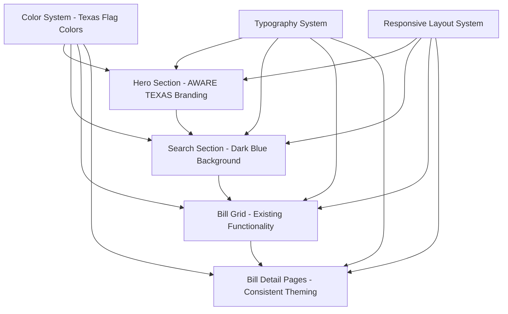

# Design Document

## Overview

The Frontend Redesign for Aware Texas transforms the existing Texas Senate Bill Tracker interface by implementing a modern, visually appealing design based on the provided Figma mockup. The redesign introduces a hero section with Texas imagery, "AWARE TEXAS" branding, and a cohesive red, white, and blue color scheme while preserving all existing functionality, performance optimizations, and responsive behavior.

## Architecture

### Design System Architecture



### Component Hierarchy

- **Layout Components**: Hero section, navigation header, main content area
- **Branding Components**: AWARE TEXAS logo, Texas flag elements, hero imagery
- **Functional Components**: Search interface, bill cards, filters (preserved from existing)
- **Utility Components**: Loading states, animations, responsive containers

## Components and Interfaces

### 1. Hero Section Component

#### Visual Design
- **Background**: Texas building image with overlay
- **Branding**: "AWARE TEXAS" prominently displayed
- **Tagline**: "CREATING A MORE INFORMED TEXAS!" with appropriate typography
- **Layout**: Full-width hero section above the search area

#### Implementation Structure
```html
<section class="hero-section">
  <div class="hero-background">
    
    <div class="hero-overlay"></div>
  </div>
  <div class="hero-content">
    <div class="hero-branding">
      <h1 class="aware-texas-logo">AWARE TEXAS</h1>
    </div>
    <div class="hero-tagline">
      <h2>CREATING A MORE INFORMED TEXAS!</h2>
    </div>
  </div>
</section>
```

#### Responsive Behavior
- **Desktop**: Full hero section with large typography
- **Tablet**: Adjusted typography sizes, maintained proportions
- **Mobile**: Stacked layout, optimized text sizes

### 2. Navigation Header Component

#### Visual Design
- **Background**: Clean white or light background
- **Branding**: "AWARE TEXAS" logo with Texas flag colors
- **Navigation**: Home, About Us links as shown in Figma
- **Layout**: Horizontal navigation bar

#### Implementation Structure
```html
<header class="navigation-header">
  <div class="nav-container">
    <div class="nav-brand">
      <span class="texas-flag-icon"></span>
      <span class="brand-text">AWARE TEXAS</span>
    </div>
    <nav class="nav-links">
      <a href="#" class="nav-link">Home</a>
      <a href="#" class="nav-link">About Us</a>
    </nav>
  </div>
</header>
```

### 3. Search Section Component

#### Visual Design
- **Background**: Dark blue (#002868) matching Figma design
- **Heading**: "SEARCH BILLS" in white text
- **Input Fields**: Rounded, modern styling with light backgrounds
- **Layout**: Centered content with proper spacing

#### Implementation Structure
```html
<section class="search-section">
  <div class="search-container">
    <h2 class="search-heading">SEARCH BILLS</h2>
    <div class="search-form">
      <div class="search-input-group">
        <input type="text" class="search-input-modern" placeholder="Search bills..." />
      </div>
      <div class="filter-groups">
        <!-- Existing filter dropdowns with new styling -->
      </div>
    </div>
  </div>
</section>
```

### 4. Enhanced Bill Grid Component

#### Preserved Functionality
- All existing bill card functionality maintained
- Hover effects, status colors, and click handlers preserved
- Search and filtering logic unchanged
- Performance optimizations retained

#### Visual Updates
- Updated card styling to match new design system
- Consistent spacing and typography
- Enhanced visual hierarchy

## Data Models

### Color System Model
```css
:root {
  /* Texas Flag Colors - Primary Palette */
  --texas-red: #BF0A30;
  --texas-white: #FFFFFF;
  --texas-blue: #002868;
  
  /* Extended Palette */
  --texas-blue-light: #1e3a8a;
  --texas-blue-dark: #001a4d;
  --texas-red-light: #dc2626;
  --texas-red-dark: #991b1b;
  
  /* Neutral Colors */
  --gray-50: #f9fafb;
  --gray-100: #f3f4f6;
  --gray-200: #e5e7eb;
  --gray-300: #d1d5db;
  --gray-400: #9ca3af;
  --gray-500: #6b7280;
  --gray-600: #4b5563;
  --gray-700: #374151;
  --gray-800: #1f2937;
  --gray-900: #111827;
}
```

### Typography System Model
```css
/* Typography Scale */
.hero-title {
  font-size: clamp(2rem, 5vw, 4rem);
  font-weight: 700;
  line-height: 1.1;
  color: var(--texas-red);
}

.hero-tagline {
  font-size: clamp(1.5rem, 3vw, 2.5rem);
  font-weight: 600;
  line-height: 1.2;
  color: var(--texas-white);
}

.search-heading {
  font-size: clamp(1.5rem, 2.5vw, 2rem);
  font-weight: 600;
  color: var(--texas-white);
  text-align: center;
}
```

### Layout System Model
```css
/* Container System */
.hero-section {
  min-height: 60vh;
  position: relative;
  display: flex;
  align-items: center;
  justify-content: center;
}

.search-section {
  background-color: var(--texas-blue);
  padding: 4rem 0;
}

.content-container {
  max-width: 1200px;
  margin: 0 auto;
  padding: 0 1rem;
}

@media (min-width: 768px) {
  .content-container {
    padding: 0 2rem;
  }
}
```

## Error Handling

### Visual Error States
- **Hero Image Loading**: Fallback background color and loading placeholder
- **Search Functionality**: Preserve all existing error handling with updated styling
- **Bill Loading**: Maintain current error boundaries with new visual treatment
- **Responsive Breakpoints**: Graceful degradation for all screen sizes

### Error Response Integration
- All existing error handling logic preserved
- Error messages styled to match new design system
- Loading states updated with new color scheme and animations

## Testing Strategy

### Visual Regression Testing
- **Component Screenshots**: Capture before/after comparisons for all major components
- **Responsive Testing**: Verify design integrity across all breakpoints
- **Cross-Browser Testing**: Ensure consistent appearance in major browsers
- **Accessibility Testing**: Verify color contrast ratios meet WCAG standards

### Functional Testing
- **Existing Functionality**: Comprehensive testing of all current features
- **Search and Filtering**: Verify all search and filter operations work unchanged
- **Navigation**: Test all links and routing functionality
- **Performance**: Ensure no regression in loading times or responsiveness

### Integration Testing
- **API Integration**: Verify all existing API calls continue to work
- **State Management**: Test all existing state management and caching
- **Event Handling**: Verify all click handlers and user interactions
- **Animation Performance**: Test smooth transitions and loading states

### User Experience Testing
- **Visual Hierarchy**: Verify improved information architecture
- **Brand Recognition**: Test effectiveness of AWARE TEXAS branding
- **Mobile Experience**: Comprehensive mobile usability testing
- **Loading Experience**: Test hero section and search area loading sequences

## Implementation Approach

### Phase 1: Core Layout Structure
1. Implement hero section with background image and overlay
2. Create navigation header with AWARE TEXAS branding
3. Build search section with dark blue background
4. Establish responsive container system

### Phase 2: Styling Integration
1. Implement Texas flag color system
2. Apply typography scale and hierarchy
3. Update form elements and input styling
4. Integrate modern rounded input designs

### Phase 3: Component Enhancement
1. Preserve all existing JavaScript functionality
2. Update CSS classes and styling
3. Maintain all existing animations and transitions
4. Ensure responsive behavior across all components

### Phase 4: Testing and Optimization
1. Comprehensive cross-browser testing
2. Performance optimization verification
3. Accessibility compliance validation
4. Mobile experience optimization

## Accessibility Considerations

### Color Contrast
- Ensure all text meets WCAG AA standards (4.5:1 ratio minimum)
- Test hero section text overlay for sufficient contrast
- Verify search section white text on blue background meets standards

### Keyboard Navigation
- Maintain all existing keyboard navigation functionality
- Ensure hero section doesn't interfere with tab order
- Preserve focus management in search and filter components

### Screen Reader Compatibility
- Add appropriate ARIA labels for hero section imagery
- Maintain existing semantic HTML structure
- Ensure brand elements are properly announced

### Mobile Accessibility
- Verify touch targets meet minimum size requirements (44px)
- Ensure responsive design maintains accessibility features
- Test with mobile screen readers and assistive technologies