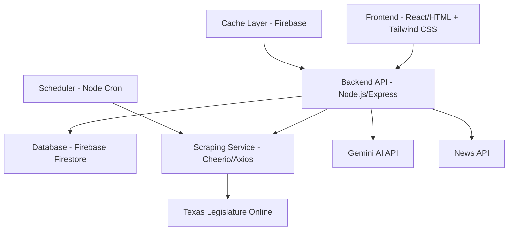

# Design Document

## Overview

The Texas Senate Bill Tracker is a full-stack web application built with Node.js backend and a responsive frontend. The system follows a three-tier architecture with data scraping services, API layer, and user interface components. The application uses Firebase for hosting and database, integrates with external APIs (Gemini AI and News API), and implements real-time data updates through automated scraping.

## Architecture

### High-Level Architecture



### Technology Stack

- **Frontend**: HTML/CSS/JavaScript with Tailwind CSS for styling
- **Backend**: Node.js with Express.js framework
- **Database**: Firebase Firestore for bill data and cache storage
- **Scraping**: Axios for HTTP requests, Cheerio for HTML parsing
- **AI Integration**: Google Gemini API for bill summaries
- **News Integration**: News API for relevant articles
- **Hosting**: Firebase Hosting for frontend, Firebase Functions for backend
- **Scheduling**: Node-cron for automated scraping

## Components and Interfaces

### Frontend Components

#### 1. Homepage Component (`/`)
- **BillGrid**: Displays bills in responsive grid layout
- **SearchBar**: Handles keyword search with live filtering
- **FilterPanel**: Multi-select dropdowns for topics and sponsors
- **BillCard**: Individual bill display with hover preview
- **LoadingSpinner**: Shows loading states

#### 2. Bill Detail Component (`/bill/:id`)
- **BillHeader**: Displays bill number, title, and status
- **SponsorInfo**: Shows sponsor details and photo
- **SummarySection**: AI-generated summary with reading level toggle
- **NewsSection**: Related news articles
- **OfficialLink**: Link to Texas Legislature page

#### 3. Shared Components
- **Navigation**: Site header with Texas flag theme
- **ErrorBoundary**: Handles and displays errors gracefully
- **StatusBadge**: Color-coded status indicators

### Backend API Endpoints

#### Bill Management
- `GET /api/bills` - Retrieve all bills with optional filters
- `GET /api/bills/:id` - Get specific bill details
- `GET /api/bills/search` - Search bills by keyword
- `POST /api/bills/refresh` - Trigger manual data refresh

#### AI Integration
- `POST /api/summary/:billId` - Generate or retrieve AI summary
- `PUT /api/summary/:billId/level` - Update reading level

#### News Integration
- `GET /api/news/:billId` - Get related news articles

#### System
- `GET /api/health` - Health check endpoint
- `GET /api/status` - System status and last update time

### Database Schema

#### Bills Collection
```javascript
{
  id: string,
  billNumber: string,
  shortTitle: string,
  fullTitle: string,
  status: 'Filed' | 'In Committee' | 'Passed',
  sponsors: [
    {
      name: string,
      photoUrl: string,
      district: string
    }
  ],
  officialUrl: string,
  billText: string,
  abstract: string,
  committee: string,
  coSponsors: [string],
  filedDate: Date,
  lastUpdated: Date,
  topics: [string]
}
```

#### Summaries Collection
```javascript
{
  billId: string,
  summaries: {
    high-level: string,
    detailed: string,
    
  },
  generatedAt: Date,
  cached: boolean
}
```

#### News Cache Collection
```javascript
{
  billId: string,
  articles: [
    {
      headline: string,
      source: string,
      url: string,
      publishedAt: Date
    }
  ],
  lastFetched: Date
}
```

## Data Models

### Bill Model
```javascript
class Bill {
  constructor(data) {
    this.id = data.id;
    this.billNumber = data.billNumber;
    this.shortTitle = data.shortTitle;
    this.fullTitle = data.fullTitle;
    this.status = data.status;
    this.sponsors = data.sponsors || [];
    this.officialUrl = data.officialUrl;
    this.billText = data.billText;
    this.abstract = data.abstract;
    this.topics = data.topics || [];
    this.lastUpdated = data.lastUpdated || new Date();
  }

  getStatusColor() {
    const colors = {
      'Filed': 'yellow',
      'In Committee': 'blue',
      'Passed': 'green'
    };
    return colors[this.status] || 'gray';
  }

  getPreviewSummary() {
    return this.abstract ? 
      this.abstract.substring(0, 150) + '...' : 
      'Summary not available';
  }
}
```

### Scraper Service
```javascript
class TexasLegislatureScraper {
  async scrapeBills() {
    // Scrape current session Senate bills
    // Parse HTML using Cheerio
    // Extract required fields
    // Return structured data
  }

  async getBillDetails(billUrl) {
    // Scrape individual bill page
    // Extract full text and additional details
  }

  validateBillData(billData) {
    // Ensure required fields are present
    // Validate data types and formats
  }
}
```

### AI Summary Service
```javascript
class SummaryService {
  async generateSummary(billText, readingLevel = 'high-level') {
    // Call Gemini API with appropriate prompts
    // Cache results in Firebase
    // Return plain-language summary
  }

  async classifyTopics(billText) {
    // Use AI to categorize bill topics
    // Return array of topic tags
  }
}
```

## Error Handling

### Frontend Error Handling
- **Network Errors**: Display retry buttons and offline indicators
- **Loading States**: Show skeletons and progress indicators
- **API Failures**: Graceful degradation with cached data
- **Search Errors**: Clear error messages with suggestions

### Backend Error Handling
- **Scraping Failures**: Log errors, use cached data, retry with exponential backoff
- **API Rate Limits**: Implement request queuing and caching strategies
- **Database Errors**: Connection pooling, transaction rollbacks
- **External API Failures**: Fallback to cached summaries and news

### Error Response Format
```javascript
{
  error: true,
  message: "User-friendly error message",
  code: "ERROR_CODE",
  details: "Technical details for debugging",
  timestamp: "2024-01-01T00:00:00Z"
}
```

## Testing Strategy

### Unit Testing
- **Frontend**: Jest + React Testing Library for component testing
- **Backend**: Jest + Supertest for API endpoint testing
- **Services**: Mock external APIs (Gemini, News API, TLO)
- **Models**: Test data validation and transformation logic

### Integration Testing
- **API Integration**: Test complete request/response cycles
- **Database Operations**: Test CRUD operations with test database
- **External APIs**: Test with sandbox/mock environments
- **Scraping**: Test with static HTML fixtures

### End-to-End Testing
- **User Flows**: Test complete user journeys from homepage to bill details
- **Search and Filtering**: Verify all filter combinations work correctly
- **Responsive Design**: Test on multiple screen sizes and devices
- **Performance**: Load testing with large datasets

### Test Data Management
- **Mock Bill Data**: Create realistic test bills covering all statuses
- **API Mocking**: Use MSW (Mock Service Worker) for external API calls
- **Database Seeding**: Automated test data setup and teardown
- **Fixtures**: Static HTML files for scraper testing

### Performance Testing
- **Load Testing**: Simulate concurrent users browsing and searching
- **API Response Times**: Ensure sub-200ms response for cached data
- **Scraping Performance**: Test scraper efficiency with large bill sets
- **Mobile Performance**: Lighthouse audits for mobile optimization

### Accessibility Testing
- **Screen Reader Compatibility**: Test with NVDA/JAWS
- **Keyboard Navigation**: Ensure all functionality accessible via keyboard
- **Color Contrast**: Verify WCAG AA compliance for status colors
- **Focus Management**: Proper focus handling in dynamic content